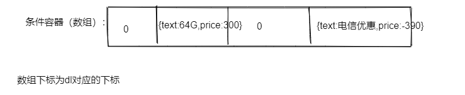

# 尚品汇JS高级-PC项目

# 面包屑导航

思考数据来自哪里？ 来自于data.js文件中

思路：

1.  获取数据源

2.  根据数据源创建相应的节点

3.  将节点支架到指定的容器中（上树）

    ​

# 实现左侧选项卡单击的切换效果

基本思路：

1. 找到对应的节点h4

2. 循环绑定单击事件

   2-1： 通过排他思想给当前元素添加类名

   2-2： 通过相应的下标，找到对应div节点，通过排他思想添加类名

# 实现底部选项卡单击的切换效果

思路：

1. 获取相应的li节点集合

2. 循环集合绑定单击事件

   2-1： 通过排他思想，给当前单击的li添加类名active

   2-2:   通过排他思想，通过指定下标找到对应tab的div节点添加类名active

# 实现右侧面板单击折叠展开效果

思路：

1. 找到类名为but的元素

2. 给其绑定单击事件

   定义一个开关变量，记录着是折叠还是展开，然后不同的变量设置不同类名，最后开关进行取反

# 实现右侧悬浮菜单功能

思路：

1. 找到对应的li集合

2. 循环li集合，给他们依次绑定鼠标悬浮和离开事件

   2-1：悬浮：找到当前li下面的i和em标签，

   ​	i变背景色，em变left

   2-2：离开：找到当前li下面的i和em标签，

   ​	i变背景色，em变left

# 实现渲染小图和缩略图

数据源来自于哪里？ 来自于data.js

渲染小图思路：

1. 默认取出第一张小图
2. 创建图片节点,上树到指定容器

渲染缩略图思路：

	1. 循环所有的小图数组
	2. 创建li节点和img节点，把img作为li的子节点
	3. 将li上树到指定容器

# 单击缩略图呈现相应的小图

思路：

1. 找到对应li节点集合

2. 循环li集合，绑定单击事件

   2-1： 找到当前节点下面的img节点

   2-2： 取出img节点src属性值,将src的值赋值给小图片src即可

# 缩略图左右箭头单击事件

思路：

1. 获取右箭头元素

2. 绑定单击事件

   让ul进行偏移（left）,每次移动步长75px

   每次移动的步长 = （li外宽 + li右外边距）

# 放大镜案例

思路： 

1. 给小图容器绑定鼠标悬浮和离开、鼠标移动

   悬浮：创建遮盖、大图容器和大图片

   离开：将上面创建的元素给销毁

   移动：让遮盖移动和大图也要移动

   ​

导致内存泄漏常见以下情况：

- 意外全局变量
- 没有关闭的时间器
- 无效的DOM引用： 节点已经从页面中删除了，但是被某个变量引用着。 所以需要给节点变量赋值为null，以便于让垃圾回收机制去回收。

连续选中：ctrl + d

查找：ctrl + f

找文件： ctrl + p

# 渲染商品基本信息

思考数据来源？ 来自于data.js

## 渲染商品基本信息

思路： 拿着数据添加到对应的节点内容，最后上树！

1. 拿着info1的标签内容
2. 将内容中的数据用data.js中的真实数据进行替换
3. 上树

##搭配区已选中的商品的数量

获取底部搭配区已选中的商品的数量：

1. 获取所有的input复选框

2. 循环input集合，判断checked是否为true, 则数量累加

3. 把数量更新到指定的容器中

   ​

## 搭配区右侧套餐价

获取底部搭配区右侧套餐价

1.  获取所有已勾选的商品的总价 
2. 套餐价 = 商品原价 + 已勾选的商品的总价 
3. 将套餐价上树

# 渲染商品的参数信息

数据来源？ 来自于data.js 中crumbData属性中

思路：

1. 根据数据crumbData，循环创建dl节点
2. 还要根据crumbData.title属性创建dt节点
3. 在根据crumbData.data循环创建dd节点
4. 将dt和dd作为dl的子节点
5. 最后将dl上树

# 单击商品参数

有四个子功能

- 当前节点要高亮显示
- 将当前选中的条件进行存入到条件容器中
- 删除已选的条件
- 实现价格联动

## 功能1：当前节点dd要高亮显示

思路：

 1. 获取所有的dl

 2. 循环dl集合，找到dl下面对应的dd集合

 3. 循环dd集合，在每个dd节点绑定单击事件

    排他思想，当前要变成红色，同辈dd节点要变成灰色

## 功能2：将当前选中的条件存入到条件容器中

思路：

1.  创建一个条件容器（数组），存入已选的参数条件，其容器对应的下标是dd所在的dl下标
2.  单击dd的将条件值存入对应下标的容器中
3.  循环条件容器，动态创建mark节点，将mark节点上树

## 功能3： 删除已选的条件

思路：

因为商品参数是属于后续动态添加的，我们希望其也有单击删除事件，所以我们可以采用事件委托去绑定。

将单击事件委托给其公共祖先`.choosed`

1. 找到`.choosed`元素，绑定单击事件
2. 只有单击的目标元素target是a节点，才执行删除当前所在mark节点
3. 重置第一个dd颜色为红色，其他同辈为灰色
4. 将对应的dl下标的条件容器元素重置为0

## 功能4：实现价格联动

思路

1. 创建dd的时候，给dd创建一个自定义属性price，记录当前条件值得一个价格

2. 点击dd的时候，获取上面price属性即可

3. 将价格存入到容器中

   容器结构如下：

   

4. 删除或添加条件只需要拿到商品的原价和已选中的条件价格做一个汇总即可

5. 最后汇总价格上树

# 单击搭配区input元素事件处理

思路：

1. 获取所有input元素

2. 循环input元素，绑定单击事件

   2-1：判断当前元素的选中状态

   选中： 拿着原来已勾选的数量++，拿着原套餐价和当前的选中的input价格相加

   未选中： 拿着原来已勾选的数量--，拿着原套餐价减去当前未选中的input元素的价格
